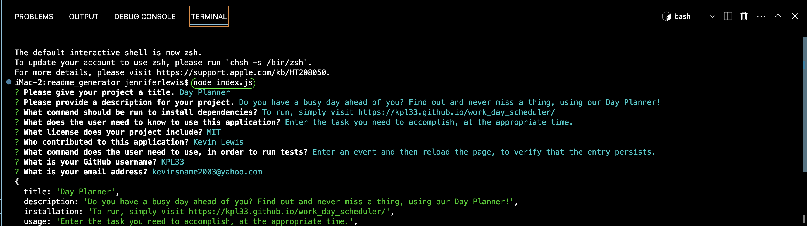
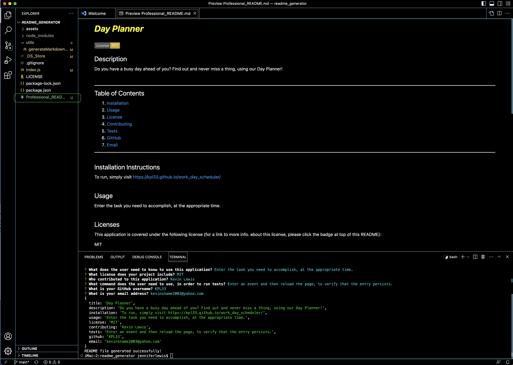

# Professional README Generator

This repository contains files relating to the 'Professional README Generator', which can dynamically create a README file based on the user’s inputs and using only the command-line interface. 

• I believe I have satisfied all acceptance criteria.
 
• Here are screenshots of the 'Professional README Generator'...

 
 

 

• Here is a link to a video demonstration of the app in action: https://github.com/KPL33/readme_generator/blob/main/assets/Kevin_Lewis_README_Gen_demo.webm

• Here is a link to the file generated in the demonstation video:
https://github.com/KPL33/readme_generator/blob/main/Professional_README.md
